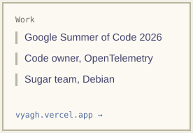
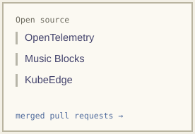
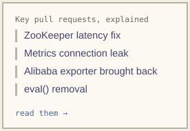

<a href="https://vyagh.vercel.app"><picture><source media="(prefers-color-scheme: dark)" srcset="tiles/work-dark.svg"></picture></a>
<a href="https://github.com/pulls?q=is%3Apr+author%3Avyagh+is%3Amerged+is%3Apublic"><picture><source media="(prefers-color-scheme: dark)" srcset="tiles/oss-dark.svg"></picture></a>
<a href="https://vyagh.vercel.app/#zookeeper-latency"><picture><source media="(prefers-color-scheme: dark)" srcset="tiles/prs-dark.svg"></picture></a>

[Resume](https://drive.google.com/file/d/12wefjaQmn3IeSK5_DwtFN3cPWizaYfml/view)
